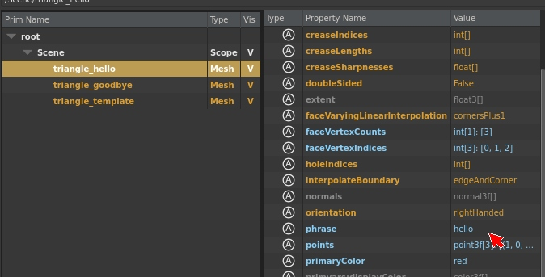
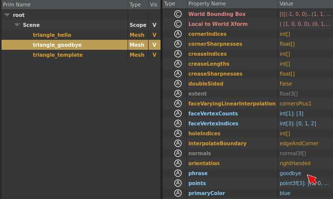
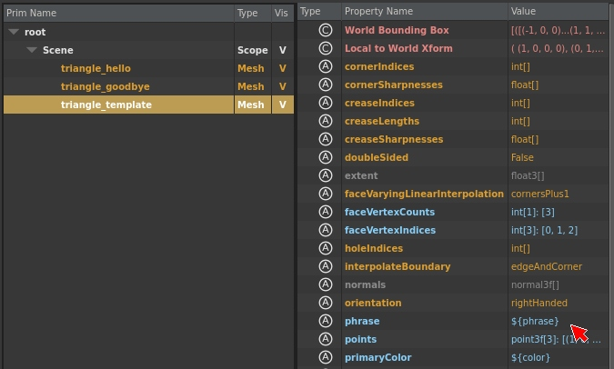

# usdat

usdat is a USD file format plugin created at DreamWorks Animation
to add flexibility to our USD pipeline. usdat is USD-ascii with templates.

# File Format

[examples/triangle.usdat](examples/triangle.usdat)

```
#usdat 1.0
(
    defaultPrim = "triangle"
)
def Mesh "triangle"
{
  int[] faceVertexCounts = [3]
  int[] faceVertexIndices = [0, 1, 2]
  point3f[] points = [(1, 0, 0), (0, 1, 0), (-1, 0, 0)] (
    interpolation = "vertex"
  )
  custom string phrase = "${phrase}"
  custom string primaryColor = "${color}"
}
```

usdat is identical to usda in almost every way, and uses the same
SdfTextFileFormat library that usda uses to process the file.
There are two notable differences:

- The magic cookie at the start of the file for for usdat is #usdat 1.0
- Templates using the syntax **${keyword}** can be replaced using
  FileFormatArguments passed to the layer before the file is
  parsed by SdfTextFileFormat.

# Example Usage

[examples/shot.usd](examples/shot.usd)

```
#usda 1.0
def Scope "Scene"
{
    def "triangle_hello" (
        append references=@./triangle.usdat:SDF_FORMAT_ARGS:phrase=hello&color=red@
    )
    {
    }
    def "triangle_goodbye" (
        append references=@./triangle.usdat:SDF_FORMAT_ARGS:phrase=goodbye&color=blue@
    )
    {
    }
    def "triangle_template" (
        append references=@./triangle.usdat@
    )
    {
    }
}
```

shot.usd references triangle.usdat three times, twice providing different
FileFormatArguments, and once providing no FileFormatArguments. In usdview,
you can see that the attribute values of *phrase* and *displayString* are
different for each triangle instance created by referencing triangle.usdat.

```
def "triangle_hello" (
    append references=@./triangle.usdat:SDF_FORMAT_ARGS:phrase=hello&color=red@
)
{
}
```


```
def "triangle_goodbye" (
    append references=@./triangle.usdat:SDF_FORMAT_ARGS:phrase=goodbye&color=blue@
)
{
}
```


When no FileFormatArguments are provided for a keyword, the template is
preserved in the file.

```
def "triangle_template" (
    append references=@./triangle.usdat@
)
{
}
```


# Usage in production

usdat allows you to define a common template layer for an asset that allows
properties and references for that asset to be defined at asset install time
as part of the *reference*
to that asset when it is added to a shot, rather than using a separate
composition arc like an override or a variant. An example use case would be storing
geometry caches on disk using the asset instance name as installed in the shot.
Suppose you define a character asset named "vikingA". Its USD definition might
include a payload to the geometry cache, like this:

```
def Scope "Geometry"
{
    def "skin" (
       prepend payload = @/path/to/library/models/vikingA.usdc@</skin>
    )
    {
    }
}
```

But suppose you have a stage with two vikings, Jonas and Ulrich....

```
def Scope "Scene"
{
    def Scope "Characters"
    {
        def "jonas" (
           prepend references = @/path/to/assets/vikingA.usd@
        )
        {
        }
        def "ulrich" (
           prepend references = @/path/to/assets/vikingA.usd@
        )
        {
        }
    }
}
```

...and their geometry caches are stored by instance name...

```
/path/to/shot_200_5/models/jonas.usdc
/path/to/shot_200_5/models/ulrich.usdc
```

Conventionally, your stage would need to override the geometry cache path,
or select it with a variantSet, or perhaps leverage a specialized asset resolver.
Using usdat, you could define the vikingA asset like this...

```
def Scope "Geometry"
{
    def "skin" (
       prepend payload = @/path/to/${model_location}/models/${asset_name}.usdc@</skin>
    )
    {
    }
}
```

And then build your stage like this...

```
def Scope "Scene"
{
    def Scope "Characters"
    {
        def "jonas" (
           prepend references = @/path/to/assets/vikingA.usdat:SDF_FORMAT_ARGS:model_location=shot_200_5&asset_name=jonas@
        )
        {
        }
        def "ulrich" (
           prepend references = @/path/to/assets/vikingA.usdat:SDF_FORMAT_ARGS:model_location=shot_200_5&asset_name=ulrich@
        )
        {
        }
    }
}
```

...and the resulting layers would automatically use the correct
geometry caches for the shot and the asset instance name.

# Considerations

usdat has the same [limitations and downsides](https://graphics.pixar.com/usd/docs/Maximizing-USD-Performance.html)
as usda, plus a few more:
- File parsing happens twice, with usdat adding a regex-replace
  pass before invoking the usda parser. This will add time to stage composition.
- Each usdat layer with unique FileFormat arguments is stored and treated
  as a unique layer in USD, rather than a single layer that can be shared
  across composition. This may have disastrous consequences for overall layer
  count on a stage if usdat is not used judiciously.

usdat can add power, simplicity, and flexibility to
a production pipeline, but it must be paired with careful USD asset design
in order to achieve the best results.
